# Telegram Food Agent Bot

A Telegram bot for diabetic-friendly meal planning, food logging, and shopping list management, with a focus on North Indian cuisine for pregnant individuals managing diabetes.

## Features
- **Conversational meal planning** powered by LLMs (OpenAI or Ollama)
- **Food log**: Save and retrieve meals
- **Shopping list**: Add, retrieve, and delete items
- **Markdown and table rendering** for easy-to-read responses
- **Supervisor integration** for auto-restart and startup

## Setup

### 1. Clone the repository
```
git clone <repo-url>
cd TelegramBots
```

### 2. Create a virtual environment
```
python3 -m venv .venv
source .venv/bin/activate
```

### 3. Install dependencies
```
pip install -r requirements.txt
```

### 4. Environment Variables
Create a `.env` file in the project root:
```
TELEGRAM_TOKEN=your_telegram_bot_token
LOG_LEVEL=INFO
```

### 5. Run the bot
```
python bot_v2.py
```

Or use Supervisor for auto-restart:
```
supervisord -c supervisord.conf
```

## Usage
- `/start` — Start the bot
- `/help` — Show help
- `/save [meal] [dish name]` — Log a meal
- `/add_to_shopping_list [item]` — Add item to shopping list
- `/retrieve_shopping_list` — Show shopping list
- `/delete_shopping_list` — Delete shopping list

Send any message to get meal recommendations and nutrition info.

## Project Structure
- `bot_v2.py` — Main entrypoint
- `src/agents/` — LLM agent logic
- `src/telegram_bot/` — Telegram handlers and utilities
- `data/` — SQLite databases
- `supervisord.conf` — Supervisor config for process management

## Security
- **Never commit your `.env` file or secrets.**
- The `.gitignore` is set up to exclude sensitive files and data.

## TODO

- **Add knowledge base for Indian meals**: Integrate a structured knowledge base or database for Indian meal recipes, nutrition, and cultural context. Should be modular and easy to extend.
- **GI API integration**: Integrate an external or custom API for Glycemic Index (GI) values. Design the integration so it can be easily swapped or extended.

## Testing

Install development dependencies:

```bash
pip install -r requirements-dev.txt
```

Run the test suite:

```bash
pytest
```

Run static analysis (formatters, linters, type checks) via pre-commit:

```bash
pre-commit run --all-files
```

## Flow Chart

```mermaid
flowchart TD
    classDef internal fill:#ADD8E6,stroke:#000,stroke-width:1px
    classDef external fill:#90EE90,stroke:#000,stroke-width:1px
    classDef datastore fill:#FFD580,stroke:#000,stroke-width:1px

    User["User (Telegram Client)"]:::external
    TelegramAPI["Telegram API"]:::external
    RunScript["run.sh"]:::external
    Supervisor["Supervisor"]:::external

    subgraph "Bot Process"
        Entrypoint["bot_v2.py"]:::internal
        subgraph "Handlers"
            Start["start_handler.py"]:::internal
            Help["help_handler.py"]:::internal
            Msg["message_handler.py"]:::internal
            Save["save_handler.py"]:::internal
            Shop["shopping_list_handler.py"]:::internal
        end
        subgraph "Telegram Utils"
            TgDB["db.py"]:::internal
            Renderer["table_renderer.py"]:::internal
            TgUtils["telegram_utils.py"]:::internal
        end
        subgraph "Agent Layer"
            Orchestrator["workflow.py"]:::internal
            LLMAdapter["llm.py"]:::internal
            Domain["food_agent.py"]:::internal
            Prompts["prompts.py"]:::internal
            Tools["tools.py"]:::internal
            subgraph "Agent Utils"
                AgentConfig["config.py"]:::internal
                AgentDB["db.py"]:::internal
            end
        end
    end

    DB["SQLite DB"]:::datastore
    OpenAI["OpenAI API"]:::external
    Ollama["Ollama API"]:::external

    User -->|sends message| TelegramAPI
    TelegramAPI -->|forwards to| Entrypoint
    Entrypoint --> Start
    Entrypoint --> Help
    Entrypoint --> Msg
    Entrypoint --> Save
    Entrypoint --> Shop

    Start -->|uses| TgUtils
    Help -->|uses| TgUtils
    Msg -->|uses| TgUtils
    Save -->|writes| TgDB
    Save -->|uses| TgUtils
    Shop -->|writes| TgDB
    Shop -->|uses| TgUtils

    Msg -->|triggers| Orchestrator
    Orchestrator -->|calls| LLMAdapter
    LLMAdapter -->|requests| OpenAI
    LLMAdapter -->|requests| Ollama
    OpenAI -->|response| LLMAdapter
    Ollama -->|response| LLMAdapter
    LLMAdapter -->|returns| Orchestrator

    Orchestrator -->|processes| Domain
    Domain -->|uses| Prompts
    Domain -->|uses| Tools
    Domain -->|stores/read| AgentDB
    Domain -->|reads| AgentConfig

    Domain -->|result| Renderer
    Renderer -->|formats| Msg
    TgDB -->|persists| DB
    AgentDB -->|persists| DB

    Supervisor -.->|monitors| Entrypoint
    RunScript -.->|starts| Entrypoint

    click Entrypoint "https://github.com/kharepratyush/telegram_food_bot/blob/main/bot_v2.py"
    click Supervisor "https://github.com/kharepratyush/telegram_food_bot/blob/main/supervisord.conf"
    click RunScript "https://github.com/kharepratyush/telegram_food_bot/blob/main/run.sh"
    click LLMAdapter "https://github.com/kharepratyush/telegram_food_bot/blob/main/src/agents/llm.py"
    click Domain "https://github.com/kharepratyush/telegram_food_bot/blob/main/src/agents/food_agent.py"
    click Prompts "https://github.com/kharepratyush/telegram_food_bot/blob/main/src/agents/prompts.py"
    click Tools "https://github.com/kharepratyush/telegram_food_bot/blob/main/src/agents/tools.py"
    click AgentConfig "https://github.com/kharepratyush/telegram_food_bot/blob/main/src/agents/utils/config.py"
    click AgentDB "https://github.com/kharepratyush/telegram_food_bot/blob/main/src/agents/utils/db.py"
    click Orchestrator "https://github.com/kharepratyush/telegram_food_bot/blob/main/src/agents/workflow/workflow.py"
    click TgDB "https://github.com/kharepratyush/telegram_food_bot/blob/main/src/telegram_bot/utils/db.py"
    click Renderer "https://github.com/kharepratyush/telegram_food_bot/blob/main/src/telegram_bot/utils/table_renderer.py"
    click TgUtils "https://github.com/kharepratyush/telegram_food_bot/blob/main/src/telegram_bot/utils/telegram_utils.py"
    click Start "https://github.com/kharepratyush/telegram_food_bot/blob/main/src/telegram_bot/handlers/start_handler.py"
    click Help "https://github.com/kharepratyush/telegram_food_bot/blob/main/src/telegram_bot/handlers/help_handler.py"
    click Msg "https://github.com/kharepratyush/telegram_food_bot/blob/main/src/telegram_bot/handlers/message_handler.py"
    click Save "https://github.com/kharepratyush/telegram_food_bot/blob/main/src/telegram_bot/handlers/save_handler.py"
    click Shop "https://github.com/kharepratyush/telegram_food_bot/blob/main/src/telegram_bot/handlers/shopping_list_handler.py"

    class Entrypoint,Start,Help,Msg,Save,Shop,TgDB,Renderer,TgUtils,Orchestrator,LLMAdapter,Domain,Prompts,Tools,AgentConfig,AgentDB internal
    class User,TelegramAPI,RunScript,Supervisor,OpenAI,Ollama external
    class DB datastore
```




## License
MIT
